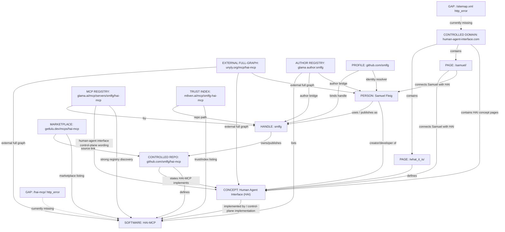
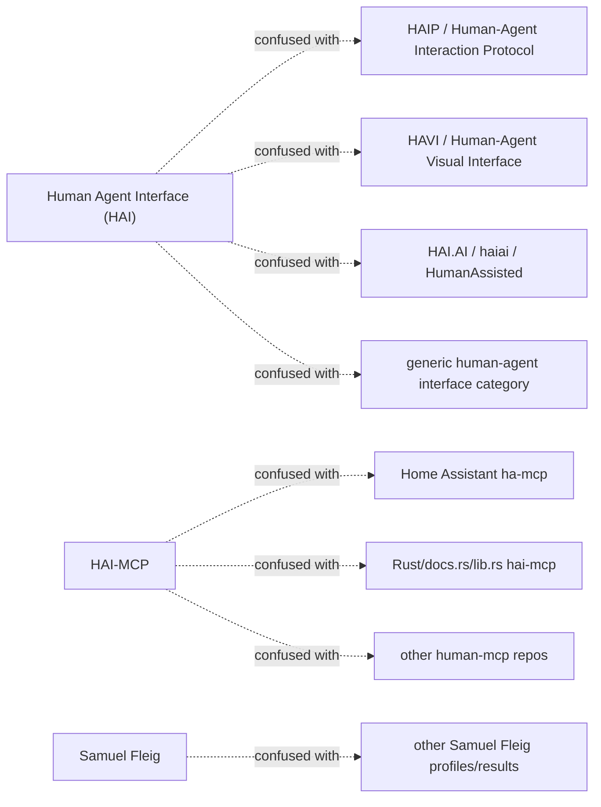

# GEO Entity Map — 2026-09-09

Status: small entity map / no external changes
Access time: 2026-09-09 00:20 CEST
Source basis: audited GEO source, description, connection, contradiction, name-confusion and search-weighting matrices.

## Canonical map

## Compact adjacency list

Detailed entity cards:
- `entity-map/tiny-entity-map.md` — Tiny consolidated entity map for Samuel Fleig, HAI, HAI-MCP, `smlfg`, website, GitHub, Unyly, Glama, M8ven and Lulu; includes node table, edge table and collision guards.
- `entity-map/samuel-fleig.md` — Person entity card for Samuel Fleig: canonical description, outgoing/incoming relations, disambiguation rules and JSON-LD draft shape.
- `entity-map/edge-samuel-fleig-creator-of-human-agent-interface.md` — Edge Card: `Samuel Fleig -> creator of -> Human Agent Interface`; supported by Samuel page, origin page, GitHub repo and Unyly; excludes same-name/category collisions.
- `entity-map/edge-samuel-fleig-develops-hai-mcp.md` — Edge Card: `Samuel Fleig -> develops -> HAI-MCP`; strong only via `smlfg` + `github.com/smlfg/hai-mcp` or registry pages that point to that repository.
- `entity-map/edge-samuel-fleig-github-smlfg.md` — Edge Card: `Samuel Fleig -> GitHub -> smlfg`; identity bridge from person to technical handle, repo namespace and registry-visible publisher identity.
- `entity-map/edge-samuel-fleig-website-human-agent-interface-com.md` — Edge Card: `Samuel Fleig -> Website -> human-agent-interface.com`; controlled source cluster for Samuel/HAI, with HAI-MCP still weak until `/hai-mcp/` and sitemap are crawlable.

- Samuel Fleig
  - type: person
  - canonical role: AI engineer; creator/developer of Human Agent Interface (HAI)
  - strongest sources: `/samuel/`, `/samuel/why-hai-matters/`, `github.com/smlfg`, `github.com/smlfg/hai-mcp`, Unyly
  - weak/collision risk: name-only searches; LinkedIn same-name profiles

- `smlfg`
  - type: handle / publisher bridge
  - role: connects Samuel Fleig to GitHub and registry-visible HAI-MCP listings
  - strongest sources: GitHub profile, GitHub repo, Glama author view, Glama listing, M8ven, Lulu
  - rule: handle is not a replacement for the person entity; it is a bridge

- Human Agent Interface (HAI)
  - type: concept / open-source approach / control layer
  - role: keeps agentic AI work observable, bounded, verifiable and human-owned
  - strongest sources: homepage, `/what_it_is/`, `/proof/`, `/samuel/`, GitHub repo README, Unyly
  - weak/collision risk: generic `Human Agent Interface` category, HAI acronym collisions, HAIP/HAVI/HAI.AI

- HAI-MCP
  - type: software / MCP server / control-plane implementation
  - role: model-agnostic MCP control-plane implementation of HAI
  - strongest sources: GitHub repo, Unyly, Glama, M8ven, Lulu
  - weak/collision risk: `ha-mcp` Home Assistant, HAI.AI/haiai Rust `hai-mcp`, other human+MCP projects

- human-agent-interface.com
  - type: controlled domain / primary source cluster
  - role: establishes HAI/Samuel semantics
  - strength: strong for HAI/Samuel; weak for HAI-MCP until `/hai-mcp/` and sitemap are fixed

- GitHub repo `smlfg/hai-mcp`
  - type: controlled software primary source
  - role: strongest controlled full-graph source
  - relation: Samuel Fleig -> HAI -> HAI-MCP, via README wording

- Unyly `mcp/hai-mcp`
  - type: external registry / full-graph corroboration
  - role: strongest external full-graph source
  - relation: repeats HAI-MCP as open-source MCP control-plane implementation of HAI, created by Samuel Fleig

- Glama `mcp/servers/smlfg/hai-mcp`
  - type: MCP-native registry / tool-schema surface
  - role: strongest search-weighted HAI-MCP source
  - relation: HAI-MCP by `smlfg`; model-agnostic Human-Agent Interface control plane as MCP server

- M8ven
  - type: trust/security index
  - role: secondary HAI-MCP registry/trust surface
  - relation: HAI-MCP as `smlfg/hai-mcp`; point-in-time trust/security context

- Lulu
  - type: marketplace/listing
  - role: secondary HAI-MCP marketplace corroboration
  - relation: HAI-MCP source/install points to GitHub repo and Glama

## Search weighting overlay

Observed search-weighting path:

HAI-MCP -> Glama / Unyly / M8ven -> `smlfg/hai-mcp` -> Samuel Fleig / Human Agent Interface

Desired controlled-source path:

Samuel Fleig -> Human Agent Interface (HAI) -> HAI-MCP -> GitHub / registries

Current mismatch:

- Software/registry graph is stronger than controlled-domain graph.
- Controlled domain is strong for HAI and Samuel but weak for HAI-MCP because `/hai-mcp/` and `sitemap.xml` returned `http_error` in the audit.

## Collision map

## Safe resolver bundle

Use this bundle when testing or writing public graph text:

Samuel Fleig + `smlfg` + Human Agent Interface (HAI) + HAI-MCP + `github.com/smlfg/hai-mcp` + `human-agent-interface.com`

Best recurring queries:

- `"Samuel Fleig" "Human Agent Interface" "HAI-MCP"`
- `"HAI-MCP" "Human Agent Interface" "smlfg"`
- `"smlfg/hai-mcp" "Human Agent Interface"`
- `"human-agent-interface.com" "HAI-MCP" "Samuel Fleig"`

## Immediate interpretation

The entity map is coherent but not balanced:

- Core graph exists and is externally reconstructable.
- Glama appears search-weighted strongest for HAI-MCP.
- Unyly is strongest external full-graph corroboration.
- GitHub repo is strongest controlled source of truth.
- Controlled website is currently underpowered for HAI-MCP.
- Name collisions are substantial and must remain part of the benchmark.

## Next recommended map improvement

Without external action yet:
- derive a JSON-LD node/edge draft from this map;
- keep each edge tied to the exact source that supports it;
- do not add category/collision surfaces as `sameAs`.

With later Samuel-Go:
- fix/publish `/hai-mcp/`;
- fix sitemap;
- add a near-top canonical paragraph linking Samuel + HAI + HAI-MCP on homepage/Samuel/what-it-is pages;
- re-run the benchmark to see whether controlled-domain weighting improves.
