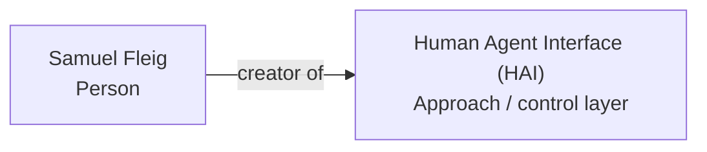

# Entity Edge — Samuel Fleig -> creator of -> Human Agent Interface

Status: entity-edge draft / no external changes
Access time: 2026-09-09 00:24 CEST

## Edge

Subject: Samuel Fleig
Predicate: creator of
Object: Human Agent Interface (HAI)
Canonical edge ID: `edge:samuel-fleig--creator-of--human-agent-interface`
Confidence: strong
Status: supported by controlled sources and external full-graph corroboration

## Plain-language assertion

Samuel Fleig is the creator/developer of Human Agent Interface (HAI), an open-source approach/control layer for keeping agentic AI work observable, bounded, verifiable and human-owned.

## Supported by

| Source | Source type | Support strength | Boundary |
|---|---|---|---|
| `https://www.human-agent-interface.com/samuel/` | controlled person page | strong | Connects Samuel Fleig with building Human Agent Interfaces and human-owned AI workflows. |
| `https://www.human-agent-interface.com/samuel/why-hai-matters/` | controlled origin narrative | strong | Explains HAI as something Samuel built from his own operator need. |
| `https://github.com/smlfg/hai-mcp` | controlled software repo | strong/full graph | README wording connects Samuel Fleig, HAI and HAI-MCP. |
| `https://unyly.org/mcp/hai-mcp` | external registry/full-graph corroboration | strong/full graph | Repeats README-style wording: HAI-MCP as implementation of HAI, created by Samuel Fleig. |
| `https://github.com/smlfg` | controlled profile/handle resolver | medium | Binds Samuel Fleig to `smlfg`; useful bridge, not full edge alone. |
| LinkedIn HAI/IPAI post | secondary social/event proof | medium | Social corroboration if visible; not primary. |

## Do not use as support

- Same-name Samuel Fleig profiles without HAI/AI/`smlfg`/domain context.
- Generic Human Agent Interface category pages.
- HAIP / Human-Agent Interaction Protocol.
- HAVI / Human-Agent Visual Interface.
- HAI.AI / haiai surfaces.
- Home Assistant `ha-mcp` sources.

## JSON-LD edge draft

```json
{
  "@id": "https://www.human-agent-interface.com/samuel/#samuel-fleig",
  "@type": "Person",
  "name": "Samuel Fleig",
  "creator": {
    "@id": "https://www.human-agent-interface.com/#human-agent-interface",
    "@type": "CreativeWork",
    "name": "Human Agent Interface (HAI)",
    "description": "An open-source approach/control layer for keeping agentic AI work observable, bounded, verifiable and human-owned."
  }
}
```

Note:
For Schema.org, the inverse may be cleaner on the HAI node:
`Human Agent Interface (HAI) -> creator -> Samuel Fleig`.
The semantic edge remains the same: Samuel Fleig -> creator of -> Human Agent Interface.

## Graph insertion



## Quality gate

Use this edge only when at least one strong source is present:
- controlled Samuel page,
- controlled GitHub repo,
- or external Unyly full-graph page.

If only `Samuel Fleig` name-only or generic `Human Agent Interface` category evidence is present, mark the edge as unresolved.
