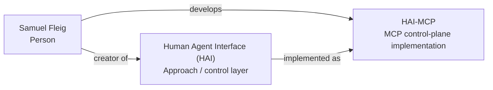

# Entity Edge — Samuel Fleig -> develops -> HAI-MCP

Status: entity-edge draft / no external changes
Access time: 2026-09-09 00:32 CEST

## Edge

Subject: Samuel Fleig
Predicate: develops
Object: HAI-MCP
Canonical edge ID: `edge:samuel-fleig--develops--hai-mcp`
Confidence: strong when resolved through `smlfg` and `github.com/smlfg/hai-mcp`
Status: supported by controlled software source and external registry corroboration

## Plain-language assertion

Samuel Fleig develops HAI-MCP, the model-agnostic MCP control-plane implementation of Human Agent Interface (HAI).

## Relationship boundary

This edge should not replace the parent semantic edge:
`Samuel Fleig -> creator of -> Human Agent Interface (HAI)`.

Correct graph chain:
`Samuel Fleig -> creator of -> Human Agent Interface (HAI) -> implemented as / control-plane implementation -> HAI-MCP`

Useful operational shortcut:
`Samuel Fleig -> develops -> HAI-MCP`

The shortcut is valid only when HAI-MCP is clearly resolved as `github.com/smlfg/hai-mcp` or a registry page that points to that repository.

## Supported by

| Source | Source type | Support strength | Boundary |
|---|---|---|---|
| `https://github.com/smlfg/hai-mcp` | controlled software repo | strongest controlled | Primary source for HAI-MCP; connects repo path, `smlfg`, HAI-MCP and canonical HAI wording. |
| `https://github.com/smlfg` | controlled profile/handle resolver | strong bridge | Binds `smlfg` to Samuel Fleig; use with repo, not alone. |
| `https://unyly.org/mcp/hai-mcp` | external full-graph registry | strong external | Repeats HAI-MCP as implementation of HAI and names Samuel Fleig / source context. |
| `https://glama.ai/mcp/servers/smlfg/hai-mcp` | MCP-native registry/tool-schema surface | strong for software visibility | Strong search-weighted HAI-MCP listing by `smlfg`; best for MCP-native discovery, weaker for Samuel name if shown only via handle. |
| `https://glama.ai/mcp/servers?query=author%3Asmlfg` | MCP-native author/search view | medium/strong bridge | Useful author bridge when it exposes Samuel Fleig or `smlfg`. |
| `https://m8ven.ai/mcp/smlfg-hai-mcp-d6jmfh` | MCP trust/index surface | medium | Corroborates HAI-MCP as `smlfg/hai-mcp`; not primary creator proof. |
| `https://getlulu.dev/mcps/hai-mcp` | MCP marketplace surface | medium | Corroborates HAI-MCP and source repo; weaker than GitHub/Unyly/Glama. |

## Do not use as support

- Home Assistant `ha-mcp` pages.
- HAI.AI / haiai / Rust `hai-mcp` pages.
- Generic `HAI-MCP` or `hai-mcp` token matches without `smlfg`, GitHub or HAI context.
- Generic Human-Agent Interface category pages.
- Same-name Samuel Fleig pages without HAI/AI/`smlfg`/domain context.
- X/Twitter profile pages from the current audit, because direct extraction was not reliable.

## JSON-LD edge draft

```json
{
  "@id": "https://www.human-agent-interface.com/samuel/#samuel-fleig",
  "@type": "Person",
  "name": "Samuel Fleig",
  "sameAs": [
    "https://github.com/smlfg"
  ],
  "makesOffer": {
    "@type": "Offer",
    "itemOffered": {
      "@id": "https://github.com/smlfg/hai-mcp#hai-mcp",
      "@type": "SoftwareSourceCode",
      "name": "HAI-MCP",
      "codeRepository": "https://github.com/smlfg/hai-mcp",
      "description": "HAI-MCP is the model-agnostic MCP control-plane implementation of Human Agent Interface (HAI)."
    }
  }
}
```

Schema note:
`develops` is the human semantic edge. In JSON-LD/Schema.org, use a cleaner supported property on the software node where possible, for example:

```json
{
  "@id": "https://github.com/smlfg/hai-mcp#hai-mcp",
  "@type": "SoftwareSourceCode",
  "name": "HAI-MCP",
  "codeRepository": "https://github.com/smlfg/hai-mcp",
  "author": {
    "@id": "https://www.human-agent-interface.com/samuel/#samuel-fleig",
    "@type": "Person",
    "name": "Samuel Fleig"
  },
  "isPartOf": {
    "@id": "https://www.human-agent-interface.com/#human-agent-interface",
    "name": "Human Agent Interface (HAI)"
  }
}
```

## Graph insertion



## Quality gate

Mark this edge as strong only when at least one of these is visible:
- `github.com/smlfg/hai-mcp`,
- Unyly `mcp/hai-mcp`,
- Glama `mcp/servers/smlfg/hai-mcp`,
- or another registry page that points to `github.com/smlfg/hai-mcp`.

If the source only says `HAI-MCP`, `hai-mcp`, `ha-mcp`, or `Human Agent Interface` without `smlfg`, GitHub, canonical domain or Samuel context, mark it as unresolved or collision-risk.
