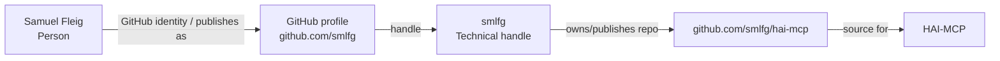

# Entity Edge — Samuel Fleig -> GitHub -> smlfg

Status: entity-edge draft / no external changes
Access time: 2026-09-09 00:33 CEST

## Edge

Subject: Samuel Fleig
Predicate: GitHub identity / publishes as
Object: `smlfg`
Canonical edge ID: `edge:samuel-fleig--github--smlfg`
Confidence: strong as a technical identity bridge
Status: controlled profile / repository-backed resolver

## Plain-language assertion

Samuel Fleig publishes technical work on GitHub under the handle `smlfg`. For the HAI graph, `smlfg` is the bridge that connects Samuel Fleig to the controlled HAI-MCP repository `github.com/smlfg/hai-mcp` and to registry pages that cite that repository.

## Relationship boundary

`GitHub -> smlfg` is not the product claim itself. It is an identity bridge.

Correct use:
`Samuel Fleig -> GitHub -> smlfg -> repository -> github.com/smlfg/hai-mcp -> HAI-MCP`

Do not collapse this into:
`Samuel Fleig = smlfg = HAI-MCP`

The handle resolves authorship/publishing context, not a separate legal person or company.

## Supported by

| Source | Source type | Support strength | Boundary |
|---|---|---|---|
| `https://github.com/smlfg` | controlled GitHub profile | strongest identity bridge | Binds Samuel Fleig to the GitHub handle `smlfg`. |
| `https://github.com/smlfg/hai-mcp` | controlled software repo | strongest HAI-MCP bridge | Uses the `smlfg` namespace and carries HAI-MCP / HAI semantic text. |
| `https://glama.ai/mcp/servers?query=author%3Asmlfg` | registry author/search view | medium/strong bridge | Exposes `smlfg` as author/publisher context for HAI-MCP listings. |
| `https://glama.ai/mcp/servers/smlfg/hai-mcp` | MCP-native registry listing | strong software bridge | Shows HAI-MCP by `smlfg`; strong for search discovery. |
| `https://m8ven.ai/mcp/smlfg-hai-mcp-d6jmfh` | trust/index registry | medium bridge | Encodes HAI-MCP as `smlfg-hai-mcp`; supports handle-to-software relation. |
| `https://getlulu.dev/mcps/hai-mcp` | marketplace listing | medium bridge | Points back to `github.com/smlfg/hai-mcp`; supports source-repo identity. |
| `https://medium.com/@smlflg` | separate handle variant / technical profile | weak-to-medium context | Similar but not identical handle string; do not use as GitHub `smlfg` proof alone. |

## Do not use as support

- `Samuelflg1` X/Twitter aliases from the current audit; direct extraction was not reliable.
- Other Samuel Fleig profiles without `smlfg`, HAI, AI Engineering, GitHub or canonical domain context.
- Any `smlfg`-like typo or profile that does not link to the controlled GitHub account.
- Registry pages that mention HAI-MCP but do not point to `github.com/smlfg/hai-mcp` or expose `smlfg`.

## JSON-LD edge draft

```json
{
  "@id": "https://www.human-agent-interface.com/samuel/#samuel-fleig",
  "@type": "Person",
  "name": "Samuel Fleig",
  "sameAs": [
    "https://github.com/smlfg"
  ],
  "identifier": [
    {
      "@type": "PropertyValue",
      "propertyID": "GitHub username",
      "value": "smlfg",
      "url": "https://github.com/smlfg"
    }
  ]
}
```

## Graph insertion



## Quality gate

Mark this edge strong only when `https://github.com/smlfg` or `https://github.com/smlfg/hai-mcp` is visible.

Mark it medium when only registry surfaces expose `smlfg` and point to `github.com/smlfg/hai-mcp`.

Mark it unresolved if only `Samuel Fleig`, `Samuelflg1`, `@smlflg`, `smlflg`, or a same-name profile appears without the controlled GitHub profile/repository.
