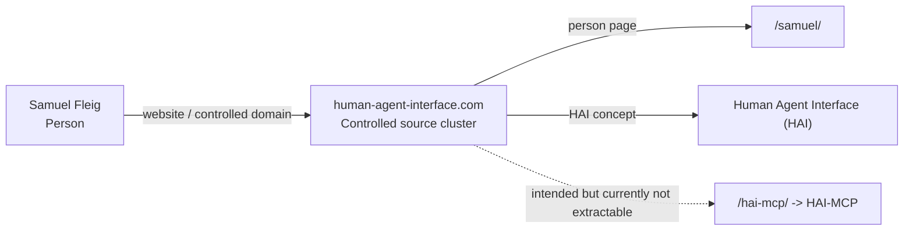

# Entity Edge — Samuel Fleig -> Website -> human-agent-interface.com

Status: entity-edge draft / no external changes
Access time: 2026-09-09 00:34 CEST

## Edge

Subject: Samuel Fleig
Predicate: website / controlled domain context
Object: `human-agent-interface.com`
Canonical edge ID: `edge:samuel-fleig--website--human-agent-interface-com`
Confidence: strong for Samuel/HAI context; partial for HAI-MCP until `/hai-mcp/` and sitemap are fixed
Status: controlled domain / primary source cluster

## Plain-language assertion

`human-agent-interface.com` is the controlled website/source cluster for Samuel Fleig's Human Agent Interface (HAI) work. It is strong for resolving Samuel Fleig and the HAI concept, but currently weaker for the HAI-MCP implementation because the intended `/hai-mcp/` page and `sitemap.xml` returned `http_error` in the audit.

## Relationship boundary

This edge establishes source ownership/context, not by itself the full software implementation claim.

Correct use:
`Samuel Fleig -> Website -> human-agent-interface.com -> /samuel/ -> Human Agent Interface (HAI)`

Current gap:
`human-agent-interface.com -> /hai-mcp/ -> HAI-MCP` is intended but not yet proven in the audit because `/hai-mcp/` was not extractable.

Do not treat the homepage alone as full proof of:
`Samuel Fleig -> HAI -> HAI-MCP`

Use the website together with GitHub/Unyly for the full graph until the controlled HAI-MCP page is live and crawlable.

## Supported by

| Source | Source type | Support strength | Boundary |
|---|---|---|---|
| `https://www.human-agent-interface.com/` | controlled homepage | strong for HAI/domain | Resolves HAI and controlled domain; Samuel/HAI-MCP only partial/nearby. |
| `https://www.human-agent-interface.com/samuel/` | controlled person page | strongest person/domain edge | Resolves Samuel Fleig and connects him to HAI context. |
| `https://www.human-agent-interface.com/samuel/why-hai-matters/` | controlled origin narrative | strong Samuel/HAI edge | Shows why HAI exists and links Samuel to the HAI origin story. |
| `https://www.human-agent-interface.com/what_it_is/` | controlled concept page | strong HAI concept | Defines HAI/control-layer semantics; not a creator/software proof alone. |
| `https://www.human-agent-interface.com/proof/` | controlled proof/method page | medium/strong HAI method | Supports HAI proof/evidence discipline; not product validation alone. |
| `https://www.human-agent-interface.com/samuel/timeline/` | controlled person/timeline page | medium person context | Supports Samuel's technical trajectory; weaker than `/samuel/`. |
| `https://www.human-agent-interface.com/robots.txt` | technical crawl surface | technical only | Crawl/access evidence, not semantic proof. |
| `https://www.human-agent-interface.com/hai-mcp/` | intended HAI-MCP page | blocked/currently weak | Returned `http_error`; do not use until live/extractable. |
| `https://www.human-agent-interface.com/sitemap.xml` | intended crawl-discovery surface | blocked/currently weak | Returned `http_error`; weakens controlled-domain discovery. |

## Do not use as support

- Generic `human agent interface` category pages outside the controlled domain.
- Strongly / Human-Agent Interface Layer article as a `sameAs` for HAI.
- HAIP / Human-Agent Interaction Protocol.
- HAVI / Human-Agent Visual Interface.
- HAI.AI / haiai pages.
- Search snippets that mention the domain but do not expose the relevant page body.

## JSON-LD edge draft

```json
{
  "@id": "https://www.human-agent-interface.com/samuel/#samuel-fleig",
  "@type": "Person",
  "name": "Samuel Fleig",
  "url": "https://www.human-agent-interface.com/samuel/",
  "mainEntityOfPage": {
    "@id": "https://www.human-agent-interface.com/samuel/",
    "@type": "WebPage",
    "url": "https://www.human-agent-interface.com/samuel/",
    "isPartOf": {
      "@id": "https://www.human-agent-interface.com/#website",
      "@type": "WebSite",
      "name": "Human Agent Interface",
      "url": "https://www.human-agent-interface.com/"
    }
  }
}
```

## Graph insertion



## Quality gate

Mark this edge strong when one of these controlled pages is visible:
- `https://www.human-agent-interface.com/samuel/`,
- `https://www.human-agent-interface.com/samuel/why-hai-matters/`,
- `https://www.human-agent-interface.com/what_it_is/`,
- `https://www.human-agent-interface.com/`.

Mark HAI-MCP-on-domain as unresolved until:
- `/hai-mcp/` returns a crawlable page,
- `sitemap.xml` includes the HAI-MCP page,
- and the visible page text states that HAI-MCP is the model-agnostic MCP control-plane implementation of HAI.
