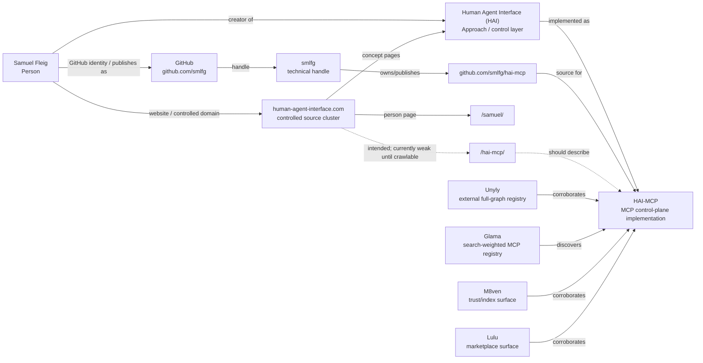

# Tiny Entity Map — Samuel Fleig / HAI / HAI-MCP

Status: tiny consolidated entity map / no external changes
Access time: 2026-09-09 00:36 CEST

## Core chain

Samuel Fleig
-> creator of -> Human Agent Interface (HAI)
-> implemented as -> HAI-MCP

Supporting identity/source edges:
- Samuel Fleig -> GitHub -> smlfg
- Samuel Fleig -> Website -> human-agent-interface.com
- smlfg -> repository -> github.com/smlfg/hai-mcp
- github.com/smlfg/hai-mcp -> source for -> HAI-MCP

## Mermaid mini-map

## Node table

| Node | Type | Role in graph | Strength |
|---|---|---|---|
| Samuel Fleig | Person | AI engineer; creator/developer of HAI | strong with `smlfg`, website, GitHub, Unyly; weak name-only |
| Human Agent Interface (HAI) | Concept / approach / control layer | Parent entity: observable, bounded, verifiable, human-owned agentic AI work | strong on controlled website and GitHub/Unyly wording |
| HAI-MCP | Software / MCP server | Model-agnostic MCP control-plane implementation of HAI | strong on GitHub, Unyly, Glama; supported by M8ven/Lulu |
| `smlfg` | GitHub handle / publisher bridge | Connects Samuel to HAI-MCP repo and registries | strong bridge; not a person replacement |
| `human-agent-interface.com` | Controlled website/source cluster | Controlled source for Samuel/HAI semantics | strong for Samuel/HAI; weak for HAI-MCP until `/hai-mcp/`/sitemap fixed |
| `github.com/smlfg/hai-mcp` | Controlled repo/source | Strongest controlled full-graph proof | strongest controlled HAI-MCP source |
| Unyly `mcp/hai-mcp` | External registry | Strongest external full-graph corroboration | strong external |
| Glama `smlfg/hai-mcp` | MCP-native registry | Search-weighted HAI-MCP discovery/tool-schema surface | strongest search-weighted HAI-MCP source |
| M8ven | Trust/index registry | Secondary trust/security corroboration | medium |
| Lulu | Marketplace registry | Secondary marketplace corroboration | medium |

## Edge table

| Subject | Predicate | Object | Confidence | Card |
|---|---|---|---|---|
| Samuel Fleig | creator of | Human Agent Interface (HAI) | strong | `entity-map/edge-samuel-fleig-creator-of-human-agent-interface.md` |
| Human Agent Interface (HAI) | implemented as / control-plane implementation | HAI-MCP | strong via GitHub/Unyly; weak on own domain until `/hai-mcp/` fixed | `GEO_HAI_HAI_MCP_CONNECTION_BY_SOURCE_2026-09-09.md` |
| Samuel Fleig | develops | HAI-MCP | strong when resolved through `smlfg` + repo | `entity-map/edge-samuel-fleig-develops-hai-mcp.md` |
| Samuel Fleig | GitHub identity / publishes as | `smlfg` | strong identity bridge | `entity-map/edge-samuel-fleig-github-smlfg.md` |
| Samuel Fleig | website / controlled domain | `human-agent-interface.com` | strong for Samuel/HAI; partial for HAI-MCP | `entity-map/edge-samuel-fleig-website-human-agent-interface-com.md` |
| `smlfg` | owns/publishes repo | `github.com/smlfg/hai-mcp` | strong | `entity-map/edge-samuel-fleig-github-smlfg.md` |
| `github.com/smlfg/hai-mcp` | source for | HAI-MCP | strong controlled | `entity-map/edge-samuel-fleig-develops-hai-mcp.md` |
| Unyly | corroborates full graph | Samuel -> HAI -> HAI-MCP | strong external | `GEO_SOURCE_DOCUMENTATION_2026-09-09.md` |
| Glama | search-weighted discovery source for | HAI-MCP | strong MCP-native | `GEO_SEARCH_ENGINE_SOURCE_WEIGHTING_2026-09-09.md` |

## Current resolver path

Search/answer engines currently seem to resolve the graph most reliably through:

`HAI-MCP -> Glama/Unyly/M8ven/Lulu -> github.com/smlfg/hai-mcp -> smlfg -> Samuel Fleig -> HAI`

Desired canonical path:

`Samuel Fleig -> creator of -> Human Agent Interface (HAI) -> implemented as -> HAI-MCP`

## Main gap

The controlled domain should eventually carry the full implementation edge:

`human-agent-interface.com -> /hai-mcp/ -> HAI-MCP -> implementation of -> HAI`

Current audit status: `/hai-mcp/` and `sitemap.xml` were not extractable, so GitHub/Unyly/Glama carry HAI-MCP more strongly than the own domain.

## Collision guards

Never resolve the graph from these standalone tokens:
- `Samuel Fleig`
- `HAI`
- `Human Agent Interface`
- `HAI-MCP`
- `hai-mcp`
- `ha-mcp`

Always require at least one anchor:
- `smlfg`
- `github.com/smlfg/hai-mcp`
- `human-agent-interface.com`
- Unyly/Glama pages that point to `smlfg/hai-mcp`
