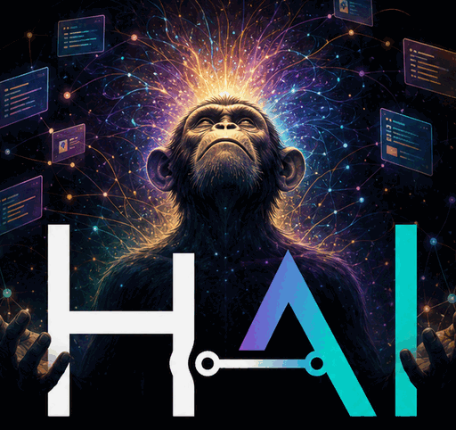
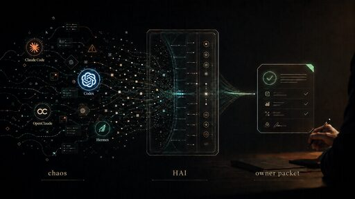
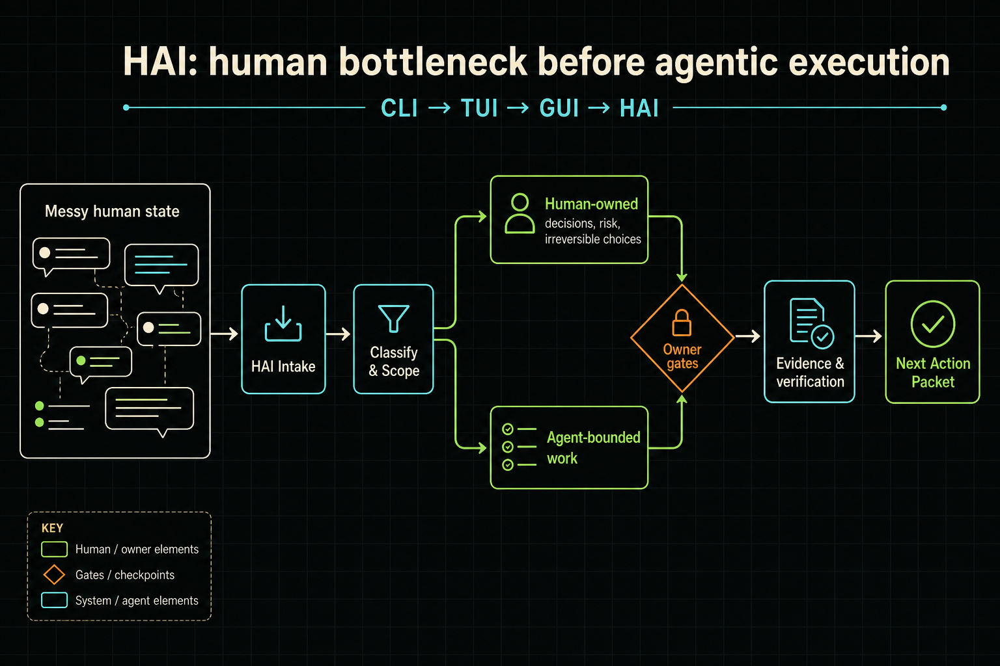
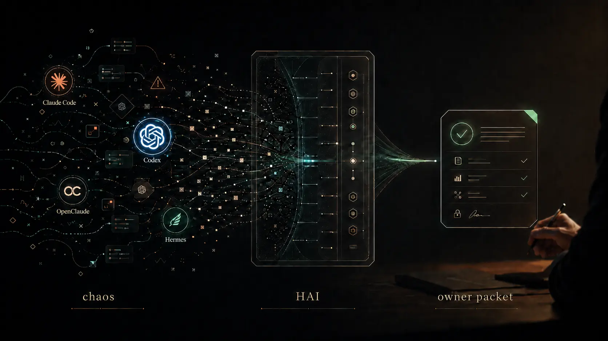
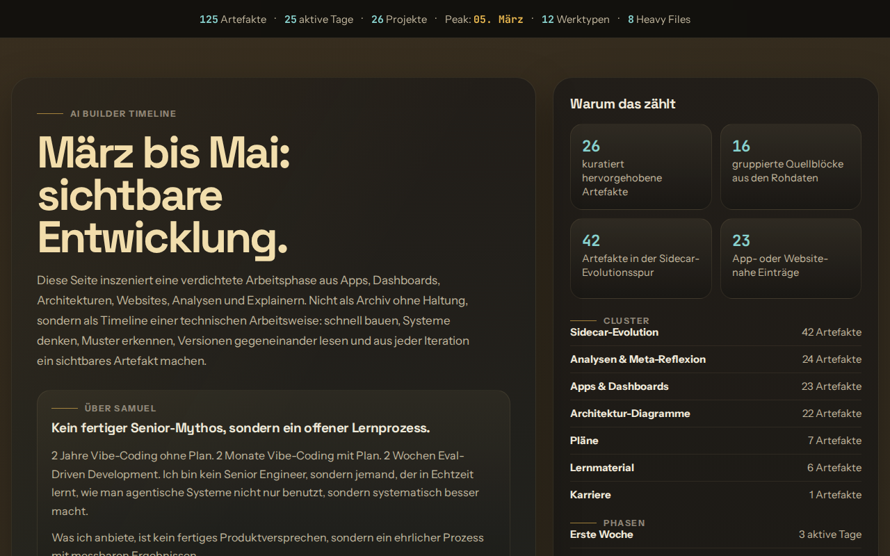
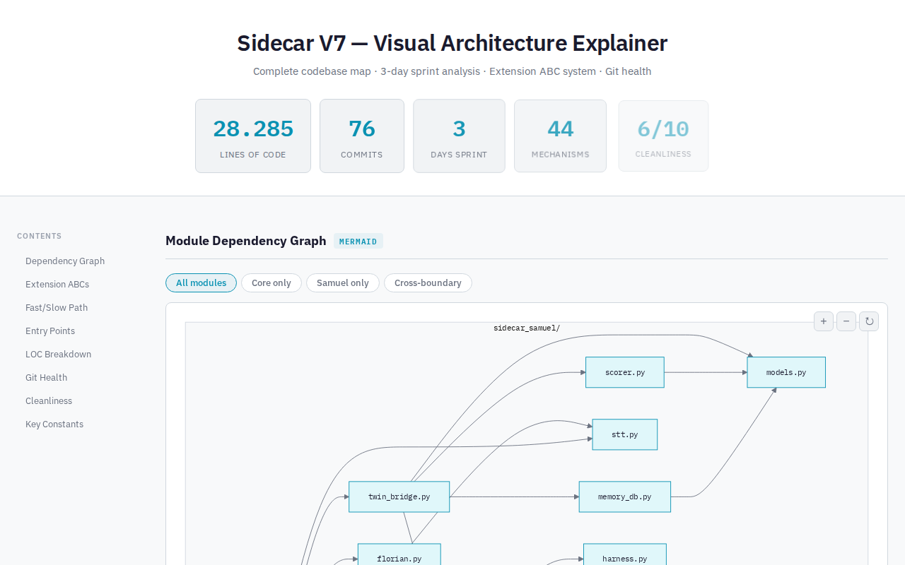
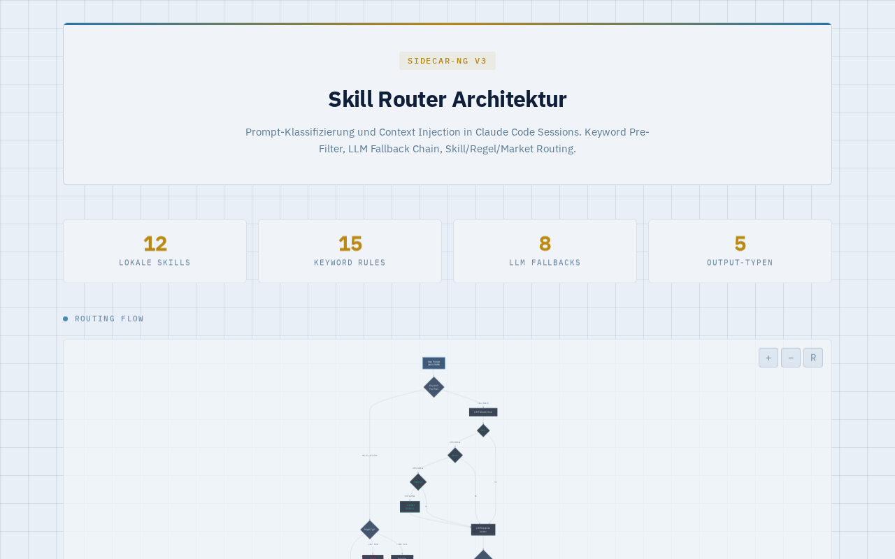

<p align="center">
  
</p>

<h1 align="center">Human Agent Interface</h1>

<p align="center">
  <strong>Turn messy AI work into a safe, scoped, agent-ready next action.</strong><br>
  <a href="https://human-agent-interface.com">human-agent-interface.com</a>
  &nbsp;·&nbsp;
  <a href="./what_it_is/">What is HAI?</a>
  &nbsp;·&nbsp;
  <a href="./product/">Products</a>
  &nbsp;·&nbsp;
  <a href="./proof/">Proof</a>
</p>

<p align="center">
  
</p>

> **CLI → TUI → GUI → HAI.** The next interface is not graphical. It is agentic.

*Product roots are German (DE); this README and most public site copy are in English.*

---

## What is HAI?

**Human Agent Interface (HAI)** is a work protocol — not a chatbot, dashboard, or auto-agent. It is the translation and control layer between **human chaos** and **systems that can act**.

When agent workflows drift — too many threads, weak ownership, false “done” signals — HAI exists to put the human back in charge: inspect, stop, verify, and own the work.

HAI turns agent chaos into work a human can still own.

## Why it exists

AI work often creates more confusion than momentum. You start with an idea, open three chats, launch an agent, paste context into another tool, then lose the thread. The output is not wrong. **It is just not owned.**

HAI exists for that moment: when the human state is messy, the agents are loud, and the next responsible action is not obvious.

| Before HAI | After HAI |
|------------|-----------|
| An idea with no shape | The problem type is named |
| Unclear ownership | Human decisions stay with the human |
| Competing agent threads | Agent work is bounded and verifiable |
| No trusted next step | A concrete **Next Action Packet** |

## Core idea: human bottleneck · owner gates · evidence

HAI treats the human as the decision bottleneck before agentic execution — not as a bottleneck to eliminate.

```text
Messy human state
    → Intake → Classify → Separate (human vs agent) → Scope
    → Owner gates → Evidence & verification → Next Action Packet
```

<p align="center">
  
</p>

### The minimum loop

1. **Intake** — Capture the messy state without pretending it is already a task.
2. **Classify** — Name what this is: decision, research, build, repair, or human-only.
3. **Separate** — Keep judgment, risk, and irreversible choices with the human.
4. **Scope** — Bound the agent work so it can be executed and checked.
5. **Packet** — Produce the next concrete action the agent can actually take.

### Owner gates & tripwires

Real HAI setups use explicit **tripwires**: moments where agentic work must change state or stop. Examples from the [Tripwire Map](./tripwire-map/):

- **Done-means-evidence gate** — verify with tests, smoke checks, or live proof before claiming done.
- **Commit-approval gate** — no commit without human approval.
- **HAI GoalBinding owner gate** — human authority over goal binding and scope changes.

Agents are **roles**, not magic: Research, Executor, Verifier, Orchestrator — each with a supervised mode.

## What's in this repo

This repository is the **source for [human-agent-interface.com](https://human-agent-interface.com)** — a static site plus Cloudflare Worker APIs, deployed via Wrangler.

| Path | Purpose |
|------|---------|
| [`index.html`](./index.html) | Homepage — pitch, fit call, method loop |
| [`what_it_is/`](./what_it_is/) | Origin story: CLI → TUI → GUI → HAI; mechanism & roles |
| [`product/`](./product/) | Commercial offers: 4h audit, system setup, Sidecar, Adminspace |
| [`proof/`](./proof/) | Artifact trail: harnesses, Sidecar, timelines, technical depth |
| [`sidecar/`](./sidecar/) | Sidecar control layer — watcher, drift, verification gates |
| [`tripwire-map/`](./tripwire-map/) | Source-backed tripwire / owner-gate reference |
| [`hai-versions/`](./hai-versions/) | HAI version evolution dossiers (V1.0–V1.6) |
| [`client-handoff/`](./client-handoff/) | Accepted-case handoff upload UI (R2-backed API) |
| [`setupinflow/`](./setupinflow/) | Interactive setup scoping form |
| [`fit/`](./fit/) | Human-fit framing for who HAI adapts to |
| [`samuel/`](./samuel/) | Builder profile, timeline, activity audit |
| [`site/`](./site/) | Audit offer & profile pages |
| [`hermes/`](./hermes/) | Hermes control-plane context |
| [`meta-mode/`](./meta-mode/) | Meta-mode exploration |
| [`Münztelfon/`](./M%C3%BCnztelfon/) | Low-friction voice/diagnostic entry (DE) |
| [`assets/`](./assets/) | Brand images, backgrounds, email assets |
| [`src/worker.js`](./src/worker.js) | Cloudflare Worker: APIs, harness check, site events |
| [`wrangler.jsonc`](./wrangler.jsonc) | Cloudflare Workers + static assets config |
| [`docs/`](./docs/) | Documentation index & README images |

See also: [`docs/README.md`](./docs/README.md) for a fuller docs map.

## Screenshots & visuals

<table>
  <tr>
    <td align="center">
      <br>
      <sub>Site hero background</sub>
    </td>
    <td align="center">
      <br>
      <sub><a href="./proof/">Proof</a> — builder timeline</sub>
    </td>
  </tr>
  <tr>
    <td align="center">
      <br>
      <sub><a href="./sidecar/">Sidecar</a> control layer</sub>
    </td>
    <td align="center">
      <br>
      <sub>Sidecar-NG skill router</sub>
    </td>
  </tr>
</table>

## Local preview & deploy

The site runs on **Cloudflare Workers** with static assets from the repo root and a Worker for `/api/*` routes.

**Prerequisites:** [Node.js](https://nodejs.org/) and [Wrangler](https://developers.cloudflare.com/workers/wrangler/).

```bash
# Install Wrangler (if needed)
npm install -g wrangler

# Local dev server (serves static files + Worker)
npx wrangler dev

# Deploy to Cloudflare
npx wrangler deploy
```

Key config in [`wrangler.jsonc`](./wrangler.jsonc):

- Static assets from `.` with `run_worker_first` for `/`, `/index.html`, `/api/*`
- R2 bucket `HAI_CLIENT_HANDOFFS` for client handoff uploads
- Analytics dataset `HAI_SITE_EVENTS` for homepage hero experiments

Private/local folders (interviews, planning notes, `.wrangler/`, etc.) are excluded from deploy.

## Related work in this ecosystem

Artifacts and references inside this repo connect to sibling projects built from the same agent-practice lineage:

| Project | Relationship |
|---------|--------------|
| [**Sidecar / Sidecar-NG**](./sidecar/) | Prototype-backed HAI control layer — watcher rules, drift detection, verification gates |
| **AgentArena** | Agent benchmarking & evaluation (see [proof](./proof/)) |
| [**Hermes**](./hermes/) | Profile-based agent control plane |
| [**HAI Versions**](./hai-versions/) | Version evolution dossiers V1.0–V1.6 |

## Status

- **Pilot:** testing HAI with the first 5–10 real workflows. One workflow, one owner packet, one follow-up.
- **First commercial unit:** paid 4h Personal HAI Audit / setup session ([product page](./product/)).
- **Contact:** [samuel@human-agent-interface.com](mailto:samuel@human-agent-interface.com) — 20 min fit call to scope one messy agent workflow.

## License

No license file is present in this repository. Site content and code are © Samuel Fleig / Human Agent Interface unless stated otherwise. Contact Samuel for reuse questions.
