# Diagramme

Ergaenzende Diagramme zu diesem Tutorial-Paket. Das Hauptdiagramm steht in
[README.md](../README.md), Abschnitt "Architektur".

## 6-Phasen-Protokoll einer Agenten-Session

Belegt in [CODEX_APP_HARNESS_TUTORIAL.md](../CODEX_APP_HARNESS_TUTORIAL.md),
Abschnitt 7, und im Runbook von [index.html](../index.html).

```mermaid
flowchart LR
    D["templates/DELEGATION_CARD.md"] --> P1["01 Intake<br/>lesen, nicht bauen"]
    P1 --> P2["02 Plan<br/>maximal sechs Schritte"]
    P2 --> P3["03 Bounded Build<br/>nur der vereinbarte Scope"]
    P3 --> P4["04 Evidence<br/>Tests, Diffs, Dateien"]
    P4 --> P5["05 Review<br/>kritische Gegenpruefung"]
    P5 --> P6["06 Handoff<br/>naechste Entscheidung"]
    P6 --> V["templates/VERIFICATION_REPORT.md"]
```

